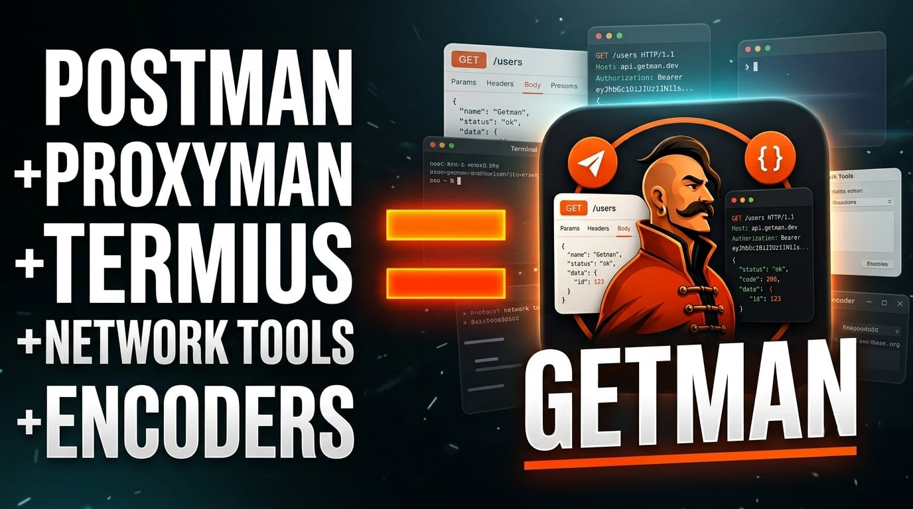

# Getman Full Developer Tools

Offline-first desktop toolkit: API client, HTTPS capture, SSH, network tools, Dropfile, and Teams - fewer apps, private by default.

API client · HTTPS capture · SSH & SCP · Network diagnostics · Encoders · Dropfile · Teams  
- one local desktop app instead of Postman + Proxyman + Termius.

[Website](https://get-man.app) · [Download](https://github.com/foryasbot/getman/releases) · [Pricing](https://get-man.app/#pricing)

---

## Demo

Watch on [YouTube](https://youtu.be/6sN9crbNbtE) · [get-man.app](https://get-man.app)

---

## Why Getman?

Most API tools push history, environments, and secrets to the cloud.  
Getman keeps your work **on your machine** - fast UI, SQLite storage, private infra stays private.

| You used to open… | Getman covers |
|-------------------|---------------|
| Postman / Insomnia | Full API client |
| Proxyman / Charles | Local HTTPS capture |
| Termius / Terminal | SSH & SCP |
| AirDrop / USB sticks | Dropfile (LAN share & chat) |
| Random utility tabs | Encoders, network tools & Wi-Fi discovery |
| Cloud "team spaces" | Teams over your own SSH server |

---

## Features

### API Client
- Collections, environments, and variables
- Cookies, auth, and request history - stored locally
- Clear history in one step; resolved `{{variables}}` in the list
- Built for daily REST work without cloud lock-in

### HTTPS Capture
- Inspect traffic on your machine
- Debug mobile and desktop apps without shipping secrets to a SaaS proxy

### SSH & SCP
- Sessions, file transfer, and remote workflows in the same window as your API work

### Network tools & utilities
- Diagnostics and encoders next to your requests - no context switching
- Wi-Fi / LAN device discovery from Network Tools

### Dropfile
- Send files between Getman devices on the same local network
- Peer discovery, live transfer speed, and chat while connected
- Pinned transfers dock (collapse / Clear) and a short sound on success

### Teams
- Share a workspace with your team over SSH
- Sync collections, requests, and environments as a bundle on your own server
- Join shared workspaces without a mandatory cloud account

### Product tour
- Guided walkthrough of major sections on first launch
- Reopen anytime from Settings or About

---

## Platforms

| Platform | Status |
|----------|--------|
| **macOS** (universal) | Yes |
| **Windows** | Yes |
| **Linux** | Coming Soon |

Downloads: [https://get-man.app](https://get-man.app)

---

## Get started

1. Download Getman from [get-man.app](https://get-man.app)
2. Open the app and start with the free core API client
3. Optionally activate a **free premium trial** from inside the app (no card required)
4. Unlock capture, SSH, Dropfile, network tools, Teams, and pro utilities with a plan when you're ready

---

## Privacy by design

- **Local-first** - workspaces and data live on your device  
- **No account required** for core API usage  
- **Teams sync** goes through *your* SSH host - not a Getman-hosted cloud vault  
- **Licensing** is handled through [get-man.app](https://get-man.app) - your request traffic doesn't need a Getman cloud backend to work

---

## What's new in 1.0.2

- Dropfile - LAN transfer, chat, transfers dock, completion sound  
- Product tour  
- Wi-Fi / LAN device discovery  
- Smarter history (clear all + resolved variables)  
- Teams workspace sharing over SSH  
- Stability improvements  

---

## License

**Proprietary.**  
© Getman contributors / Abdollah Raeisi. All rights reserved.

This repository is for product visibility and releases.  
You may download and use official builds under the commercial terms at [get-man.app](https://get-man.app).  
Unauthorized copying, redistribution, or commercial use of the source or binaries is prohibited.

---

## Support

- Website: [https://get-man.app](https://get-man.app)  
- Issues: use GitHub Issues for bugs and feature requests  

---

  <b>Less tool juggling. More shipping.</b> 
  <a href="https://get-man.app">Try Getman →</a>

